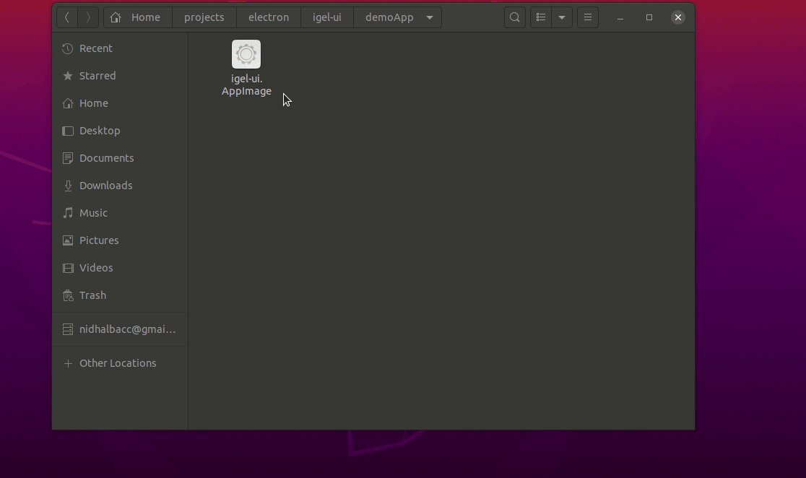
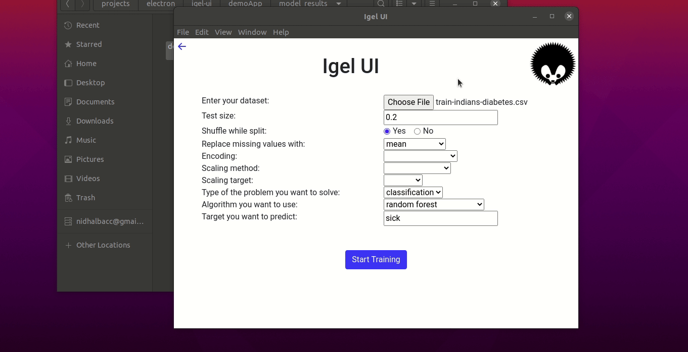

# Igel UI

Igel UI is the official app that allows you to easily interacte with [**igel**](https://github.com/nidhaloff/igel) from a simple UI instead of using the terminal.

> **_NOTE:_**  The UI is still under heavy development. Please consider supporting this project!

## Motivation

The goal of [igel](https://github.com/nidhaloff/igel) is to provide ergonomic machine learning for everyone. Both technical and non-technical users. 

I received many positive feedbacks from people and developers allover the world for creating igel. However, I noticed that some of them would find it great if a GUI can be implemented since non-technical users are not familiar with the terminal.

Therefore, I started this project. I'm actually a bad designer/frontend developer and very busy these days, but I still want to help people, who requested this. Furthermore, it's very exciting to build such an app that will be used by many people. Therefore, I'm hoping that the community will support me on developing this app, especially frontend developers who are familiar with **electron**! 

We tried to use tkinter to develop a GUI first, since it's a python GUI framework but that wasn't a good choice. You can check this [**issue**](https://github.com/nidhaloff/igel/issues/17) for more. That's why, I made some research and decided now to use the **electron** framework. It appears to be a great choice for developing cross platform desktop apps and since it uses html, css and js, so why not right?

## Installation

You can install the pre-release here from the repository. Just check the releases and you can download an executable version there.

Otherwise, you can clone the repository and build the version yourself by running `npm run dist`.

## Usage

I will demonstrate how to use the app by providing an example using the [**indian-diabetes-dataset**](https://github.com/nidhaloff/igel/tree/master/examples/data/indian-diabetes)

- Train/Fit a model:

- After completion, the results can be found in the **model_results** folder in the current working directory:

- You can now evaluate the model:

## Contribution

If you wish to work on this app, you can start by opening an issue or feature/enhancement and describe what and why it will be helpful. You can clone the repo and make a pull request afterwards. I will review it asap.

If you have experience with frontend dev & electron and you are serious about helping in the development of this project, then you can contact me and we can discuss the approaches and whether you want to maintain this project.